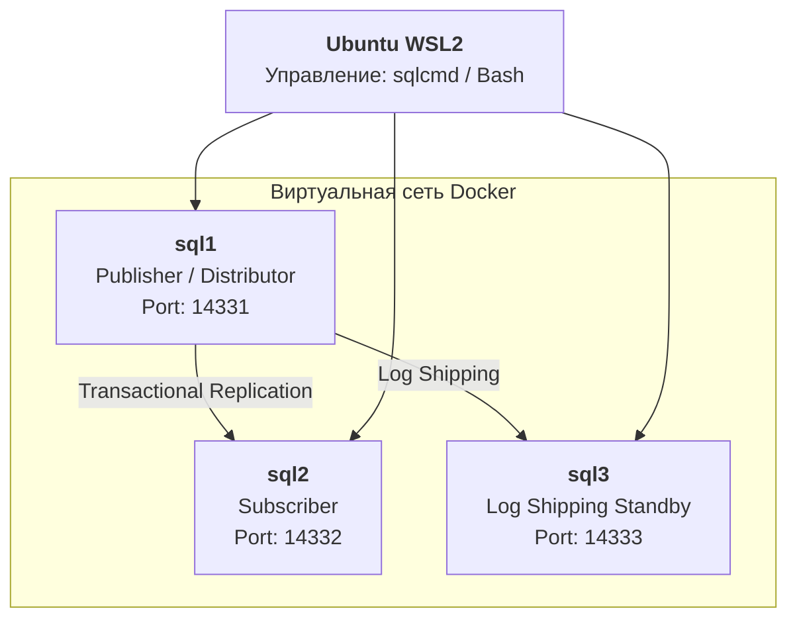

# MS SQL Server Administration

**Студент:** Ксения Хаджинова  
**Группа:** 320604  
**Стек технологий:** Docker, SQL Server 2022 (Linux Edition), Ubuntu (WSL2), Bash, T-SQL

Этот репозиторий представляет собой комплексный проект по развертыванию, защите и оптимизации инфраструктуры MS SQL Server в контейнеризированной среде.

---

##  Архитектура инфраструктуры

Проект имитирует распределенную корпоративную сеть из трех узлов, взаимодействующих через внутреннюю сеть Docker.



> [!IMPORTANT]  
> **Логика разделения баз данных:**  
> Для чистоты демонстрации проект использует:  
> - **Database Test** (Лабы 1.2–1.3): "Песочница" для файлов, лимитов роста и Disaster Recovery  
> - **Database ProjectDB** (Лабы 1.4–2.3): Промышленная среда для безопасности, автоматизации и репликации

---

##  Навигация по курсу

| Папка | Описание задачи | Основные скрипты |
|-------|-----------------|------------------|
| `00-environment-setup` | Подготовка Docker-среды и сидинг данных | `docker-compose.yml`, `init.sql` |
| `01-sql-installation` | Проверка инстансов и связности | `check_version.sql`, `check_instances.sh` |
| `02-database-management` | Filegroups, NDF-файлы, схемы | `create_test_db.sql`, `check_db_files.sql` |
| `03-backup-restore` | Disaster Recovery, corruption | `simulate_corruption.sh`, `restore_after_corruption.sql` |
| `04-security-management` | Роли, логины, DENY | `setup_logins_roles.sql`, `test_security_access.sql` |
| `05-admin-automation` | SQL Agent, Alerts, Database Mail | `configure_agent_mail.sql`, `create_backup_job.sql` |
| `06-replication-ha` | Репликация sql1→sql2, Standby sql3 | `setup_replication_distributor.sql`, `verify_lab_06.sh` |
| `07-monitoring-troubleshoot` | DMV, Extended Events, Columnstore | `query_optimization.sql`, `extended_events_setup.sql` |

---

##  Быстрый запуск

### 1. Подготовка среды

```bash
git clone https://github.com/KsushaKhadzhinova/mssql-administration-labs.git
cd mssql-administration-labs
docker-compose up -d
```

### 2. Автоматическое выполнение всех заданий

```bash
chmod +x scripts/run_all_labs.sh
./scripts/run_all_labs.sh
```

---

##  Обслуживание

### Полная очистка

Сброс системы до начального состояния:

```bash
chmod +x scripts/cleanup.sh
./scripts/cleanup.sh
```

---

##  Контакты

**Автор:** Ксения Хаджинова  
**Email:** kseniyakhadzhynava@gmail.com

---

**Проект готов к демонстрации!** Загружай в корень репозитория.
